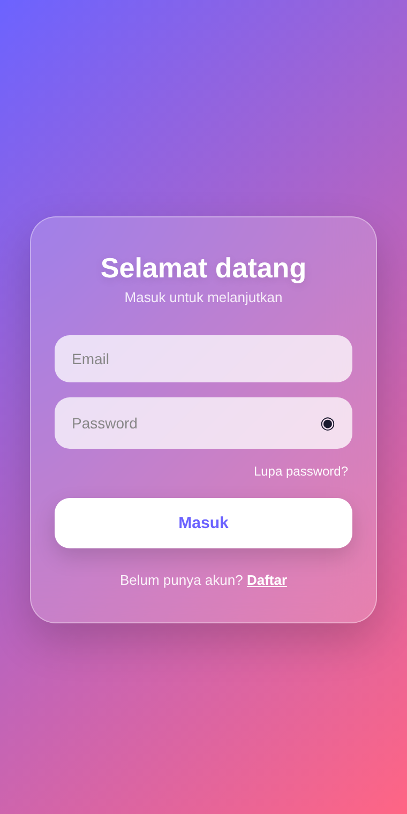
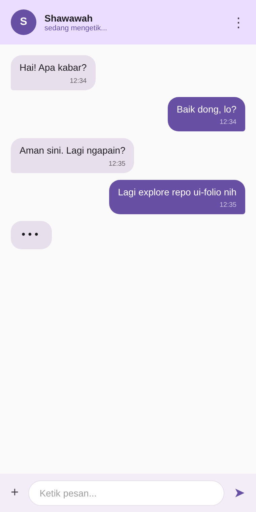

<div align="center">

# ui-folio

A curated shelf of mobile UI kits — Flutter, React Native, SwiftUI, Jetpack Compose.

</div>

<p align="center">
  
  
  
  
  <br>
  
  
  
  
  
</p>

---

Kumpulan UI kit mobile siap pakai, lintas framework. Daripada mulai dari blank page tiap project, ambil satu dari sini, sesuaikan, jalan.

Setiap kit punya kode lengkap, screenshot, dan catatan customisasi. Tidak ada boilerplate yang dipaksakan, tidak ada template AI — cuma kode biasa yang ditulis tangan.

---

## Table of contents

- [Kits](#kits)
- [Categories](#categories)
- [How to use](#how-to-use)
- [Folder layout](#folder-layout)
- [Contributing](#contributing)
- [Roadmap](#roadmap)
- [License](#license)

---

## Kits

### 1. Login screen — minimalist (Flutter)

Login bersih dengan tipografi bold, tombol solid, dan validasi inline. Cocok untuk aplikasi modern yang ingin tampil simpel tanpa banyak ornamen.

<p align="center">
  
</p>

- Responsive, jalan di mobile sampai tablet
- Dark mode ikut sistem
- Validasi email & password real-time
- Loading state di tombol

Lihat di [`flutter/login-screen-minimalist/`](./flutter/login-screen-minimalist).

---

### 2. Login screen — glassmorphism (React Native)

Login dengan efek kaca buram di atas background gradient. Pakai `expo-blur`, animasi halus via `react-native-reanimated`.

<p align="center">
  
</p>

- Efek blur asli di iOS, fallback di Android
- Dark mode ready
- Form dengan validasi
- Berjalan di iOS, Android, Web

Lihat di [`react-native/login-screen-glassmorphism/`](./react-native/login-screen-glassmorphism).

---

### 3. Profile screen — iOS style (SwiftUI)

Profile screen ala Instagram tapi lebih tenang. Cover image, avatar floating, stats row, action buttons, dan grid postingan.

<p align="center">
  
</p>

- Cover image dengan gradient overlay
- Avatar floating dengan border putih
- Stats row (posts, followers, following)
- LazyVGrid untuk performa

Lihat di [`swiftui/profile-screen-ios/`](./swiftui/profile-screen-ios).

---

### 4. Chat UI — Material 3 (Jetpack Compose)

Chat screen dengan bubble pesan corner-cut khas Material 3, typing indicator animasi, dan input bar mengambang ala Telegram.

<p align="center">
  
</p>

- Bubble pesan terkirim dan diterima berbeda
- Typing indicator dengan animasi
- Input bar dengan tombol attach dan send
- LazyColumn untuk performa tinggi

Lihat di [`jetpack-compose/chat-ui-material3/`](./jetpack-compose/chat-ui-material3).

---

## Categories

Repo ini akan terus diisi. Roadmap kategori:

- **Auth & onboarding** — login, register, OTP, onboarding carousel, biometric
- **Dashboard & analytics** — admin panel, sales analytics, crypto wallet, fitness tracker
- **E-commerce** — product listing, detail, cart, checkout, order tracking
- **Profile & social** — profile page, settings, chat, feed, story viewer
- **Navigation** — bottom bar, drawer, tab bar, FAB menu, bottom sheet
- **Misc** — weather, food delivery, booking, news, banking

---

## How to use

Clone repo, masuk folder kit yang kamu mau, ikuti README di sana.

```bash
git clone https://github.com/shawawah12-alt/ui-folio.git
cd ui-folio/flutter/login-screen-minimalist
flutter pub get
flutter run
```

Atau unduh folder tertentu saja lewat [DownGit](https://downgit.github.io/) kalau gak mau clone semuanya.

---

## Folder layout

```
ui-folio/
├── flutter/
│   └── login-screen-minimalist/
├── react-native/
│   └── login-screen-glassmorphism/
├── swiftui/
│   └── profile-screen-ios/
├── jetpack-compose/
│   └── chat-ui-material3/
├── assets/
│   └── previews/
├── CONTRIBUTING.md
├── CODE_OF_CONDUCT.md
└── LICENSE
```

---

## Contributing

Fork, bikin branch, tambah kit atau perbaiki yang ada, buka PR. Aturan lengkap di [`CONTRIBUTING.md`](./CONTRIBUTING.md).

Beberapa hal yang perlu diingat:

- Tulis kode sendiri, jangan salin dari repo berlisensi restriktif
- Pixel-perfect, responsive, accessible — bukan cuma cantik di screenshot
- Dark mode wajib
- Sertakan screenshot atau GIF di README kit kamu

---

## Roadmap

- [x] 4 starter kit (satu per framework)
- [ ] 20 kit Flutter
- [ ] 20 kit React Native
- [ ] 20 kit SwiftUI
- [ ] 20 kit Jetpack Compose
- [ ] Kotlin Multiplatform
- [ ] .NET MAUI
- [ ] Website showcase

---

## License

MIT. Bebas dipakai untuk apa saja, personal maupun komersial. Sertakan atribusi lisensi saja.

Lihat [`LICENSE`](./LICENSE) untuk teks lengkapnya.

---

<div align="center">

Built by hand. Open an issue if something breaks, or a discussion if you have an idea.

</div>
