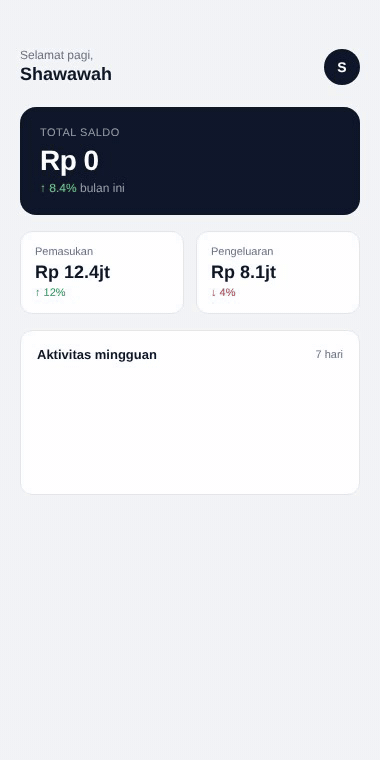
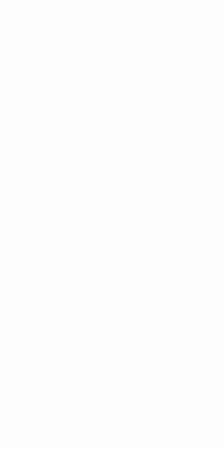
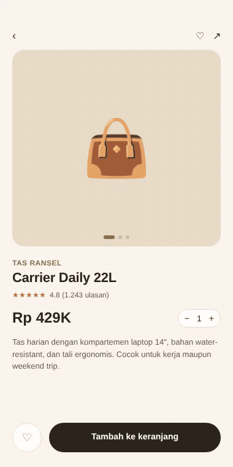
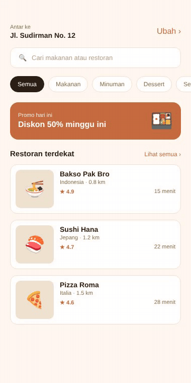
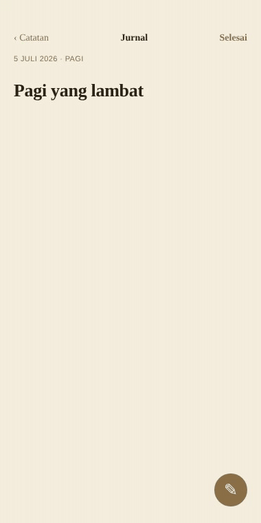
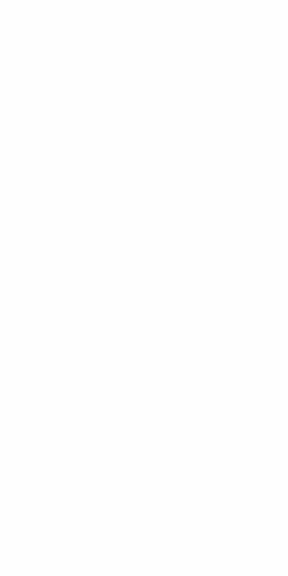

<div align="center">

# ui-folio

A curated shelf of mobile UI kits — Flutter, React Native, SwiftUI, Jetpack Compose.

</div>

<p align="center">
  
  
  
  
  <br>
  
  
  
  
  
</p>

---

Kumpulan UI kit mobile siap pakai, lintas framework. Daripada mulai dari blank page tiap project, ambil satu dari sini, sesuaikan, jalan.

Setiap kit punya kode lengkap (`*.dart`, `*.tsx`, `*.swift`, `*.kt` — bukan cuma mockup), preview GIF beranimasi, dan catatan customisasi. Tidak ada template AI — cuma kode biasa yang ditulis tangan dengan palet yang dipilih satu per satu.

---

## Table of contents

- [Flutter kits](#flutter-kits)
- [React Native kits](#react-native-kits)
- [SwiftUI kits](#swiftui-kits)
- [Jetpack Compose kits](#jetpack-compose-kits)
- [How to use](#how-to-use)
- [Folder layout](#folder-layout)
- [Contributing](#contributing)
- [Roadmap](#roadmap)
- [License](#license)

---

## Flutter kits

### 1. Login screen — minimalist

Login ala Swiss. Putih, hitam, satu accent, tanpa gradient, tanpa shadow. Input pakai border bawah 1px.

<p align="center">
  
</p>

Lihat di [`flutter/login-screen-minimalist/`](./flutter/login-screen-minimalist).

<details>
<summary><b>Lihat 4 Flutter kit lainnya</b></summary>
<br>

#### 2. Onboarding carousel

3 slide dengan ilustrasi sirkular (sage/sand/sky) dan dots indicator animated. Tombol "Lewati" di kanan atas, berubah jadi "Mulai" di slide terakhir.

<p align="center">
  
</p>

Lihat di [`flutter/onboarding-carousel/`](./flutter/onboarding-carousel).

#### 3. Dashboard — finance

Dashboard keuangan dengan animated balance counter, dua stat card, dan bar chart mingguan. Palet slate dark `#0F172A`.

<p align="center">
  
</p>

Lihat di [`flutter/dashboard-finance/`](./flutter/dashboard-finance).

#### 4. Weather forecast

Weather app dengan gradient sky lembut (light blue → cream), hourly forecast 5 jam, dan weekly forecast dengan bar range suhu.

<p align="center">
  
</p>

Lihat di [`flutter/weather-forecast/`](./flutter/weather-forecast).

#### 5. Settings — paper

Settings screen ala paper. Palet cream `#FAF7F0` dengan accent sand dan toggle golden `#D4A437`. Group cards dengan divider tipis.

<p align="center">
  
</p>

Lihat di [`flutter/settings-paper/`](./flutter/settings-paper).

</details>

---

## React Native kits

### 1. Login screen — warm dark

Login dengan palet coklat hangat dark mode. Background warm near-black `#1A1714`, accent terracotta `#C66B3D`.

<p align="center">
  
</p>

Lihat di [`react-native/login-screen-warm/`](./react-native/login-screen-warm).

<details>
<summary><b>Lihat 4 React Native kit lainnya</b></summary>
<br>

#### 2. E-commerce product detail

Product detail dengan gallery auto-rotating 3 slide, rating stars, quantity selector, dan bottom bar (favorite + add to cart). Palet sand/cream + terracotta.

<p align="center">
  
</p>

Lihat di [`react-native/e-commerce-product/`](./react-native/e-commerce-product).

#### 3. Music player

Music player ala vinyl record. Piringan hitam berputar dengan border emas, progress bar emas, tombol play/pause. Palet dark premium `#0F0F0F` + gold `#D4AF37`.

<p align="center">
  
</p>

Lihat di [`react-native/music-player/`](./react-native/music-player).

#### 4. Food delivery home

Home screen food delivery dengan location header, search bar, kategori scrollable, banner promo, dan list restoran. Palet cream + terracotta.

<p align="center">
  
</p>

Lihat di [`react-native/food-delivery/`](./react-native/food-delivery).

#### 5. Fitness tracker

Fitness dashboard dark green `#0A1410` dengan ring progress langkah (SVG), 4 stat card, dan bar chart mingguan. Animated counter + ring saat load.

<p align="center">
  
</p>

Lihat di [`react-native/fitness-tracker/`](./react-native/fitness-tracker).

</details>

---

## SwiftUI kits

### 1. Profile screen — iOS classic

Profile screen ala profile bawaan iOS. Putih bersih, navbar tipis 44pt, avatar centered, accent iOS blue `#007AFF`.

<p align="center">
  
</p>

Lihat di [`swiftui/profile-screen-ios/`](./swiftui/profile-screen-ios).

<details>
<summary><b>Lihat 4 SwiftUI kit lainnya</b></summary>
<br>

#### 2. Notes — journal

Editor jurnal dengan palet kertas cream `#F5EFE0`. Tipografi serif untuk body, sans untuk chrome. Bottom FAB untuk edit.

<p align="center">
  
</p>

Lihat di [`swiftui/notes-journal/`](./swiftui/notes-journal).

#### 3. Calendar — minimal

Calendar monthly view dengan accent red `#D64545`. Days grid dengan dot indicator untuk hari ada event, today highlighted, agenda di bawah.

<p align="center">
  
</p>

Lihat di [`swiftui/calendar-minimal/`](./swiftui/calendar-minimal).

#### 4. Wallet — cards

Wallet app dark green forest `#0F1F1A`. Animated balance counter, kartu bank dengan chip emas, dan list transaksi dengan icon berwarna. Accent green `#4ADE80`.

<p align="center">
  
</p>

Lihat di [`swiftui/wallet-cards/`](./swiftui/wallet-cards).

#### 5. News reader

News reader ala koran editorial. Brand "The Daily." dengan titik merah, horizontal tab strip, hero article, dan list items dengan thumbnail. Accent red `#C8102E`.

<p align="center">
  
</p>

Lihat di [`swiftui/news-reader/`](./swiftui/news-reader).

</details>

---

## Jetpack Compose kits

### 1. Chat UI — monochrome

Chat screen monochrome. Bubble terkirim charcoal `#1A1A1A`, diterima `#F4F4F6`. Border 1px `#ECECEC`. Tanpa warna Material 3.

<p align="center">
  
</p>

Lihat di [`jetpack-compose/chat-ui-monochrome/`](./jetpack-compose/chat-ui-monochrome).

<details>
<summary><b>Lihat 4 Jetpack Compose kit lainnya</b></summary>
<br>

#### 2. Email inbox

Email inbox dengan palet cream paper `#F5F0E6`. Folder chips horizontal, list email dengan avatar berwarna, subject bold untuk unread, FAB "Tulis".

<p align="center">
  
</p>

Lihat di [`jetpack-compose/email-inbox/`](./jetpack-compose/email-inbox).

#### 3. Todo — sticky notes

Todo list ala sticky notes. Tiap card diberi rotasi kecil dan warna kuning/amber selang-seling, dengan pin merah. Checkbox toggle dengan strike-through.

<p align="center">
  
</p>

Lihat di [`jetpack-compose/todo-sticky/`](./jetpack-compose/todo-sticky).

#### 4. Calculator — terminal

Calculator ala terminal green-on-black. Display 64sp dengan glow, tombol operator terminal green `#00FF88`, tombol equals solid green.

<p align="center">
  
</p>

Lihat di [`jetpack-compose/calculator-terminal/`](./jetpack-compose/calculator-terminal).

#### 5. Maps — paper

Maps screen ala paper map `#E8DFC8`. Jalan putih dengan border tan, park sage, water soft blue. Pin terracotta dengan pulse, bottom card info tempat.

<p align="center">
  
</p>

Lihat di [`jetpack-compose/maps-paper/`](./jetpack-compose/maps-paper).

</details>

---

## How to use

Clone repo, masuk folder kit yang kamu mau, ikuti README di sana.

```bash
git clone https://github.com/shawawah12-alt/ui-folio.git
cd ui-folio/flutter/login-screen-minimalist
flutter pub get
flutter run
```

Atau unduh folder tertentu saja lewat [DownGit](https://downgit.github.io/) kalau gak mau clone semuanya.

Setiap kit berisi file kode asli per framework (`.dart` + `pubspec.yaml`, `.tsx` + `package.json`, `.swift`, `.kt`), bukan cuma mockup. Tinggal jalankan di editor / simulator masing-masing.

---

## Folder layout

```
ui-folio/
├── flutter/
│   ├── login-screen-minimalist/    .dart + pubspec.yaml
│   ├── onboarding-carousel/
│   ├── dashboard-finance/
│   ├── weather-forecast/
│   └── settings-paper/
├── react-native/
│   ├── login-screen-warm/          .tsx + package.json
│   ├── e-commerce-product/
│   ├── music-player/
│   ├── food-delivery/
│   └── fitness-tracker/
├── swiftui/
│   ├── profile-screen-ios/         .swift
│   ├── notes-journal/
│   ├── calendar-minimal/
│   ├── wallet-cards/
│   └── news-reader/
├── jetpack-compose/
│   ├── chat-ui-monochrome/         .kt
│   ├── email-inbox/
│   ├── todo-sticky/
│   ├── calculator-terminal/
│   └── maps-paper/
├── assets/
│   └── previews/                   PNG + GIF previews
├── CONTRIBUTING.md
├── CODE_OF_CONDUCT.md
└── LICENSE
```

---

## Contributing

Fork, bikin branch, tambah kit atau perbaiki yang ada, buka PR. Aturan lengkap di [`CONTRIBUTING.md`](./CONTRIBUTING.md).

Beberapa hal yang perlu diingat:

- Tulis kode sendiri, jangan salin dari repo berlisensi restriktif
- Pixel-perfect, responsive, accessible — bukan cuma cantik di screenshot
- Dark mode wajib (atau eksplisit light only dengan alasan)
- Sertakan preview PNG atau GIF di README kit kamu
- Hindari gradient warna mencolok (biru-merah, ungu-pink) — pilih palet yang tenang
- Pilih palet yang spesifik: cream paper, warm dark, forest green, terminal, monochrome, sand, dll. Bukan "default Material" atau "iOS blue gradient"

---

## Roadmap

- [x] 4 starter kit (satu per framework)
- [x] 20 kit total (5 per framework)
- [ ] 50 kit total
- [ ] Kotlin Multiplatform
- [ ] .NET MAUI
- [ ] Website showcase

---

## License

MIT. Bebas dipakai untuk apa saja, personal maupun komersial. Sertakan atribusi lisensi saja.

Lihat [`LICENSE`](./LICENSE) untuk teks lengkapnya.

---

<div align="center">

Built by hand. Open an issue if something breaks, or a discussion if you have an idea.

</div>
