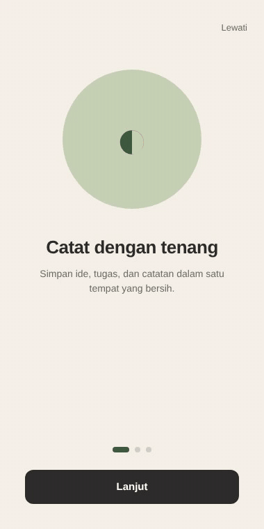

# Onboarding carousel (Flutter)

Onboarding 3 slide dengan ilustrasi sirkular dan dots indicator. Palet tenang: sage green, sand, sky blue — bukan gradient mencolok.

## Preview



## Detail

- Background cream `#F5F1E8`
- Tiga slide dengan illo sirkular warna berbeda (sage, sand, sky)
- Dots indicator animated (active dot memanjang)
- Tombol "Lewati" di kanan atas
- Tombol berubah jadi "Mulai" di slide terakhir
- Tipografi Inter

## Cara pakai

```bash
cd flutter/onboarding-carousel
flutter pub get
flutter run
```

## Customisasi

- Slides: list `_slides` di `lib/main.dart` — tambah/edit sesuai kebutuhan
- Warna illo: ubah `illoBg` dan `illoFg` per slide
- Teks: `title` dan `body` per slide

## Tech stack

- Flutter 3.x
- Dart 3.x
- `google_fonts` (Inter)

## License

MIT
