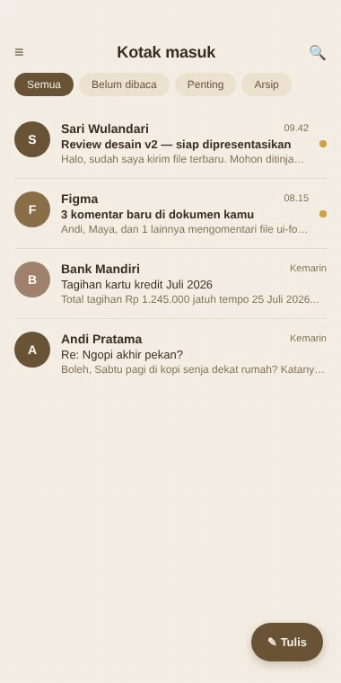

# Email inbox (Jetpack Compose)

Email inbox dengan palet cream paper. Top bar minimalis, folder chips horizontal, list email dengan avatar berwarna, subject bold untuk unread, dan FAB "Tulis" dengan ikon.

## Preview



## Detail

- Background cream `#F5F0E6`
- Card putih dengan divider tipis
- Avatar bulat dengan warna gradasi tan
- Unread dot golden `#D4A437`
- Folder chips dengan active state solid tan
- Tipografi Roboto

## Cara pakai

```bash
cd jetpack-compose/email-inbox
# Buka di Android Studio, atau:
./gradlew assembleDebug
./gradlew installDebug
```

## Customisasi

- Folder: edit list `folders` di `InboxScreen`
- Email data: edit list `emails` di `InboxScreen`
- Avatar warna: edit `AvatarBg1/2/3` di atas file

## Tech stack

- Jetpack Compose 1.6+
- Kotlin 1.9+
- Min SDK 24, Target SDK 34

## License

MIT
