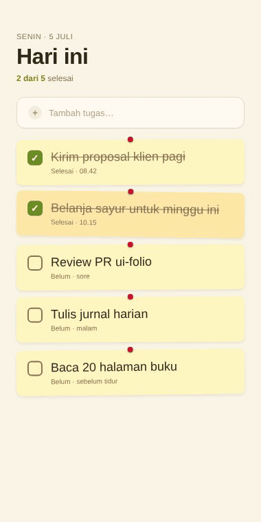

# Todo — sticky notes (Jetpack Compose)

Todo list ala sticky notes. Tiap task card diberi rotasi kecil (-0.6° sampai 0.7°) dan warna kuning/amber selang-seling, dengan pin merah di atas. Checkbox toggle dengan strike-through saat selesai.

## Preview



## Detail

- Background paper `#FAF6E8`
- Card sticky yellow `#FFF7C2` dan amber `#FFE9A8`
- Pin merah di tiap card
- Card miring sedikit (rotasi random)
- Checkbox hijau `#6B8E23` saat done, teks strikethrough
- Tipografi handwritten feel via Caveat (di Compose pakai default sans)

## Cara pakai

```bash
cd jetpack-compose/todo-sticky
# Buka di Android Studio, atau:
./gradlew assembleDebug
./gradlew installDebug
```

## Customisasi

- Tasks: edit list `tasks` di `TodoScreen`
- Warna card: ubah `CardYellow` / `CardAmber`
- Rotation: edit array `when (i % 5)` di `TaskCard`

## Tech stack

- Jetpack Compose 1.6+
- Kotlin 1.9+
- Min SDK 24, Target SDK 34

## License

MIT
