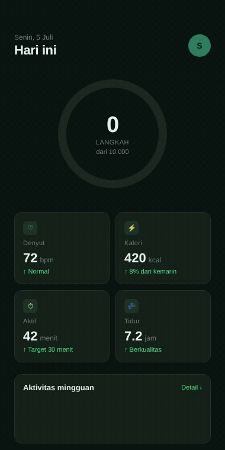

# Fitness tracker (React Native)

Fitness dashboard dark green dengan ring progress langkah, 4 stat card (denyut, kalori, aktif, tidur), dan bar chart mingguan. Animated counter + ring saat load.

## Preview



## Detail

- Background dark green `#0A1410`
- Card `#142219` dengan border `#1F3327`
- Ring SVG dengan stroke dasharray animated
- 4 stat card dengan icon berwarna berbeda (green, cyan, yellow, pink)
- Bar chart 7 hari, today highlighted

## Cara pakai

```bash
cd react-native/fitness-tracker
npm install
npx expo start
```

## Customisasi

- Target langkah: ubah `TARGET_STEPS`
- Current langkah: ubah `CURRENT_STEPS`
- Stats: edit array `STATS`
- Bars: edit array `BARS`

## Tech stack

- React Native 0.74+
- Expo SDK 51+
- TypeScript
- `react-native-svg` (untuk ring)

## License

MIT
