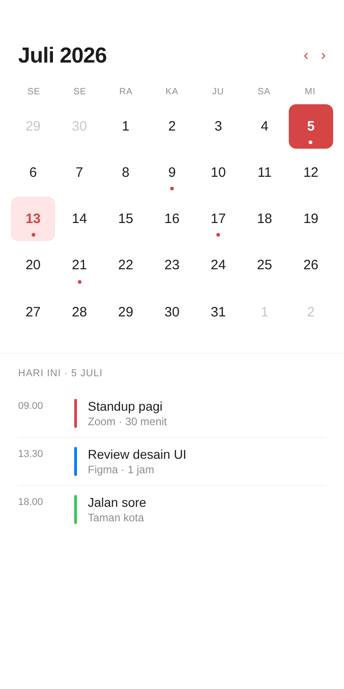

# Calendar — minimal (SwiftUI)

Calendar monthly view dengan accent red `#D64545`. Header month + nav arrows, weekdays strip, days grid dengan dot indicator untuk hari ada event, today highlighted, dan agenda di bawah.

## Preview



## Detail

- Background putih
- Accent red `#D64545` untuk today, event dot, dan nav arrows
- Selected day pakai tinted background
- Agenda dengan vertical color bar per event
- Tipografi SF Pro

## Cara pakai

```bash
cd swiftui/calendar-minimal
open CalendarMinimal.xcodeproj
# Cmd+R di simulator
```

## Customisasi

- Bulan/tahun: ubah string 'Juli 2026'
- Hari today: ubah kondisi `dayForIndex(i) == 5` di DayCell
- Events: edit list di `EventRow` di bawah

## Tech stack

- SwiftUI 5
- iOS 17+
- Xcode 15+

## License

MIT

---

# 🇬🇧 English

Monthly calendar view with red accent `#D64545`. Month header + nav arrows, weekdays strip, days grid with dot indicator for days with events, today highlighted, and agenda below.

## Preview


## Detail

- White background
- Red accent `#D64545` for today, event dot, and nav arrows
- Selected day uses a tinted background
- Agenda with a vertical color bar per event
- SF Pro typography

## How to use

```bash
cd swiftui/calendar-minimal
open CalendarMinimal.xcodeproj
# Cmd+R di simulator
```

## Customization

- Month/year: change the 'Juli 2026' string
- Today: change the `dayForIndex(i) == 5` condition in DayCell
- Events: edit the `EventRow` list below

## Tech stack

- SwiftUI 5
- iOS 17+
- Xcode 15+

## License

MIT
