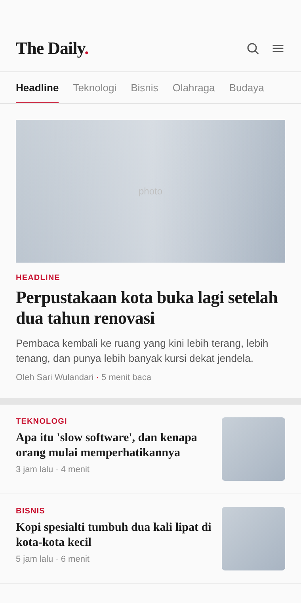

# News reader (SwiftUI)

News reader ala koran editorial. Brand 'The Daily.' dengan titik merah, horizontal tab strip dengan ikon search & menu SVG, hero article, dan list items dengan thumbnail. Tipografi serif untuk headline, sans untuk chrome.

## Preview



## Detail

- Background off-white `#FAFAFA`
- Accent red `#C8102E`
- Brand serif dengan titik merah
- Tabs horizontal dengan underline merah
- Hero dengan foto gradient placeholder
- List item dengan thumbnail kanan

## Cara pakai

```bash
cd swiftui/news-reader
open NewsReader.xcodeproj
# Cmd+R di simulator
```

## Customisasi

- Headline: ubah teks di VStack hero
- Tab list: edit array `tabs`
- Article list: tambah/edit `NewsListItem`

## Tech stack

- SwiftUI 5
- iOS 17+
- Xcode 15+

## License

MIT

---

# 🇬🇧 English

Editorial-style news reader. 'The Daily.' brand with a red dot, horizontal tab strip with SVG search & menu icons, hero article, and list items with thumbnails. Serif typography for headlines, sans for chrome.

## Preview


## Detail

- Off-white background `#FAFAFA`
- Red accent `#C8102E`
- Serif brand with red dot
- Horizontal tabs with red underline
- Hero with a gradient placeholder photo
- List item with thumbnail on the right

## How to use

```bash
cd swiftui/news-reader
open NewsReader.xcodeproj
# Cmd+R di simulator
```

## Customization

- Headline: change the text in the hero VStack
- Tab list: edit the `tabs` array
- Article list: add/edit `NewsListItem`

## Tech stack

- SwiftUI 5
- iOS 17+
- Xcode 15+

## License

MIT
