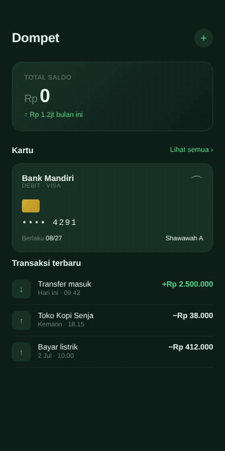

# Wallet — cards (SwiftUI)

Wallet app dark green forest. Animated balance counter on load, balance card, kartu bank dengan chip emas, dan list transaksi dengan icon berwarna. Palet `#0F1F1A` + green accent `#4ADE80`.

## Preview



## Detail

- Background forest dark `#0F1F1A`
- Card `#1A3329` dengan border `#1F3D2E`
- Balance counter animasi naik dengan `withAnimation`
- Chip kartu gradient emas
- Tx row dengan icon box berwarna

## Cara pakai

```bash
cd swiftui/wallet-cards
open WalletCards.xcodeproj
# Cmd+R di simulator
```

## Customisasi

- Target balance: ubah `targetBalance`
- Kartu: ganti brand name, masked number, expiry
- Transaksi: tambah/edit `TxRow` di bawah

## Tech stack

- SwiftUI 5
- iOS 17+
- Xcode 15+

## License

MIT
